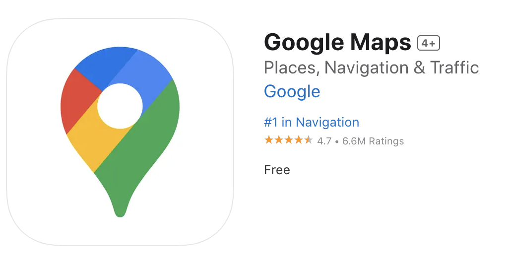
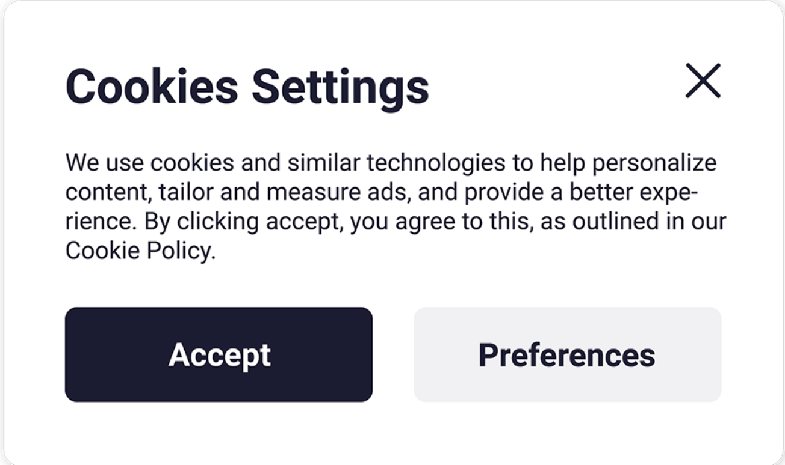

# Why should I be concerned about protecting my privacy?
- Whilst engaging in transportation, it is important to be aware of how your privacy may be violated.
- This is particularly important when using apps such as Google maps, and also during international travels.
- Often, personal information is collected without us knowing, especially from our smartphones.
- Being aware of how to protect privacy whilst traveling is extremely beneficial, especially since immigrants may be looking to navigate how to get to new and unfamiliar places, and they may be traveling to and from their home countries.

# How can Google Maps violate my privacy?
- Apps such as Google maps have faced controversies in the past for violating privacy.
- For example, street view on Google maps has garnered some controversy, cars parked outside may have had their license plates identified and collected by Google (Binder, 2024)
- Google is known for tracking its users, such as tracking user location (Hansen, 2025).
- It is recommended to turn off Cookies to avoid being tracked (Hansen, 2025).
- Google maps is free (Apple, 2025):

# What are cookies?
- Cookies are in our electric devices.
- Cookies collects information from us, and track what we do online (Browne, 2024).
- Websites and apps may ask if you consent to using cookies (Owen-Jones, 2024):

# How do I turn cookies off? (Google, 2025)
- Turn on your phone.
- Open the Google Chrome app.
- Click **Settings**.
- Then, click **Site Settings > Third Party Cookies**
- Click **Block third-party cookies**

# Why am I being tracked in the first place?
- Apps and platforms such as Google engage in tracking to create a profile of you and your interests so they can advertise better products to you in the hopes that you will spend money (Hansen, 2025).
- Surveillance is commonly utilized by companies such as Google so they can make more money.

# *Canada's Privacy Act*
- According to the *Canada's Privacy Act* which applies to all Canadian citizens, and those who are physically within Canada, the law is relevant when individuals either exit or enter Canada.
- *Canada's Privacy Act* states that you have the right to access the personal information that has been collected by the federal government.
- If you need to access this information for any reason, you need to fill out a (Personal Information Request form, which can be found by clicking here)[https://www.tbs-sct.canada.ca/tbsf-fsct/350-58-nf-eng.pdf]
- After you fill out this form, it needs to be sent to the institution in which you want your personal information from (Office of the Privacy Commissioner of Canada, 2019).

# How can I protect my privacy while traveling abroad?
- Note: your cybersecurity is at risk while traveling. It is important to be mindful when connecting to Wi-Fi networks in unfamiliar spaces, as hackers are more likely to steal information in these spaces (Government of Canada, 2024).
- Turn your Wi-Fi off to avoid getting automatically connected to unfamiliar Wi-Fi networks (Government of Canada, 2024). Alternatively, you can also update the settings on your phone so that it does not automatically connect to unknown Wi-Fi networks.
- Always remember to log out of any accounts, especially when using publicly available computers abroad (Government of Canada, 2024).
- Be cautious when using Bluetooth devices, such as pairing your phone with Bluetooth enabled cars (Government of Canada, 2024). This is ultimately your choice but be aware that the data from your phone that contains your personal information may get transferred to the car's system (Government of Canada, 2024). This could happen whilst connecting your phone's GPS system to the car's Bluetooth system.

# References
Apple. (2025). Google Maps on the App store. [https://apps.apple.com/us/app/google-maps/id585027354](https://apps.apple.com/us/app/google-maps/id585027354)

Binder, M. (2024). Leaked Google database affects cars caught on Google Maps, children's privacy, and more. *Mashable*. [https://mashable.com/article/leaked-google-privacy-incident-database](https://mashable.com/article/leaked-google-privacy-incident-database)

Browne, R. (2024). What Google's decision to keep cookies means for the internet. *CNBC*. [https://www.cnbc.com/2024/07/23/what-google-decision-to-keep-cookies-means-for-the-internet.html](https://www.cnbc.com/2024/07/23/what-google-decision-to-keep-cookies-means-for-the-internet.html)

Google. (2025). Turn cookies on or off. [https://support.google.com/accounts/answer/61416?hl=en&co=GENIE.Platform%3DAndroid](https://support.google.com/accounts/answer/61416?hl=en&co=GENIE.Platform%3DAndroid)

Government of Canada. (2021). Canada's privacy act. [https://www.justice.gc.ca/eng/csj-sjc/pa-lprp/pa-lprp.html](https://www.justice.gc.ca/eng/csj-sjc/pa-lprp/pa-lprp.html)

Government of Canada. (2024). Cyber security while travelling. [https://travel.gc.ca/travelling/health-safety/cyber-safe](https://travel.gc.ca/travelling/health-safety/cyber-safe)

Hansen, K. (2025). Can Google track your location when you're using a VPN. *Cyberghost*. [https://www.cyberghostvpn.com/privacyhub/how-does-google-know-your-location-with-vpn/](https://www.cyberghostvpn.com/privacyhub/how-does-google-know-your-location-with-vpn/)

Owen-Jones, J. (2024). Understanding internet cookies and what they do. *FutureTheory*. [https://futuretheory.co/understanding-internet-cookies/](https://futuretheory.co/understanding-internet-cookies/)

Office of the Privacy Commissioner of Canada. (2019). Accessing your personal information - Federal governement. [https://www.priv.gc.ca/en/privacy-topics/accessing-personal-information/api_gov/#fedgov](https://www.priv.gc.ca/en/privacy-topics/accessing-personal-information/api_gov/#fedgov)
